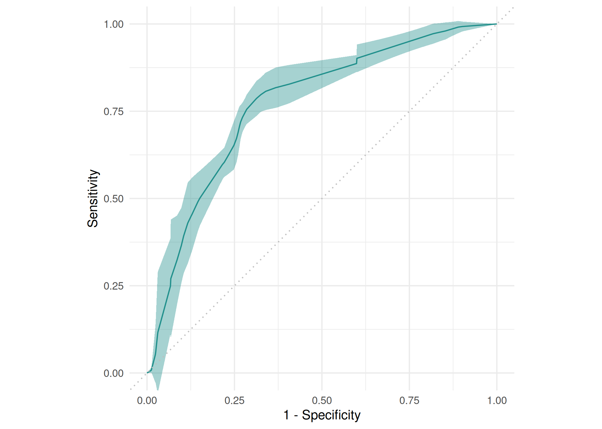

# mlr3viz 

Package website: [release](https://mlr3viz.mlr-org.com/) |
[dev](https://mlr3viz.mlr-org.com/dev/)

<!-- badges: start -->

[](https://github.com/mlr-org/mlr3viz/actions/workflows/r-cmd-check.yml)
[](https://cran.r-project.org/package=mlr3viz)
[](https://stackoverflow.com/questions/tagged/mlr3)
[](https://lmmisld-lmu-stats-slds.srv.mwn.de/mlr_invite/)
<!-- badges: end -->

*mlr3viz* is the visualization package of the
[mlr3](https://mlr-org.com/) ecosystem. It features plots for mlr3
objects such as task, learners, predictions, benchmark results, tuning
instances and filters via the `autoplot()` generic of
[ggplot2](https://ggplot2.tidyverse.org/). The package draws plots with
the [viridis](https://CRAN.R-project.org/package=viridisLite) color
palette and applies the [minimal
theme](https://ggplot2.tidyverse.org/reference/ggtheme.html).
Visualizations include barplots, boxplots, histograms, ROC curves, and
Precision-Recall curves.

## Installation

Install the last release from CRAN:

``` r
install.packages("mlr3")
```

Install the development version from GitHub:

``` r
remotes::install_github("mlr-org/mlr3viz")
```

## Short Demo

``` r
library(mlr3)
library(mlr3viz)

task = tsk("pima")
learner = lrn("classif.rpart", predict_type = "prob")
rr = resample(task, learner, rsmp("cv", folds = 3), store_models = TRUE)

# Default plot for task
autoplot(task, type = "target")
```

<!-- -->

``` r
# ROC curve for resample result
autoplot(rr, type = "roc")
```

<!-- -->

For more examples plots you can have a look at the [pkgdown
references](https://mlr3viz.mlr-org.com/reference/index.html) of the
respective functions.
